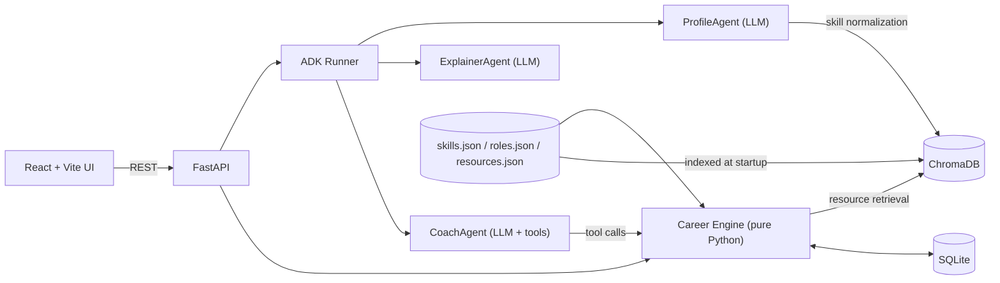
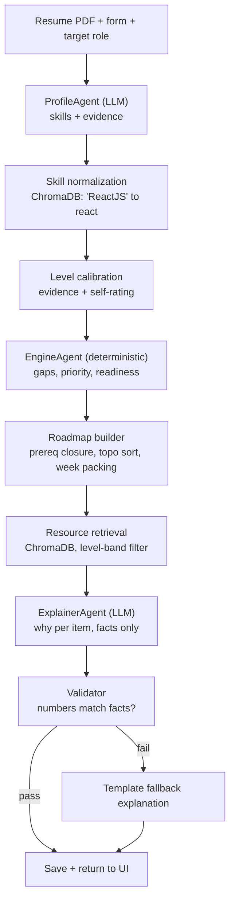
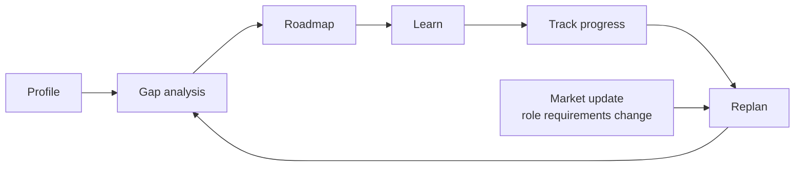
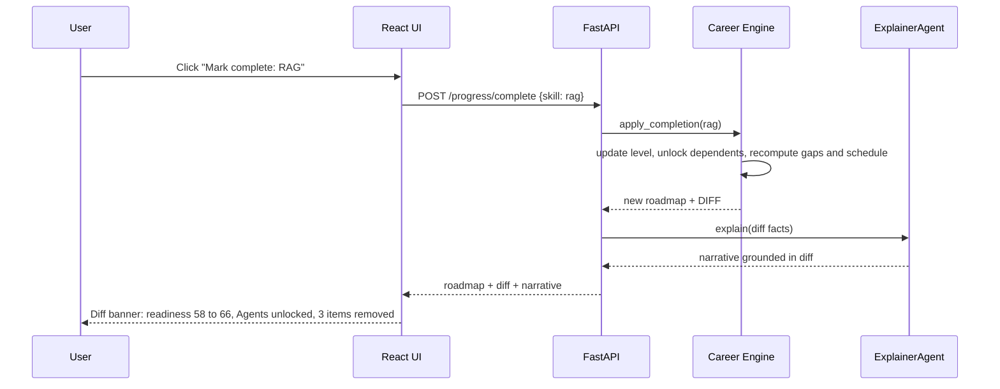
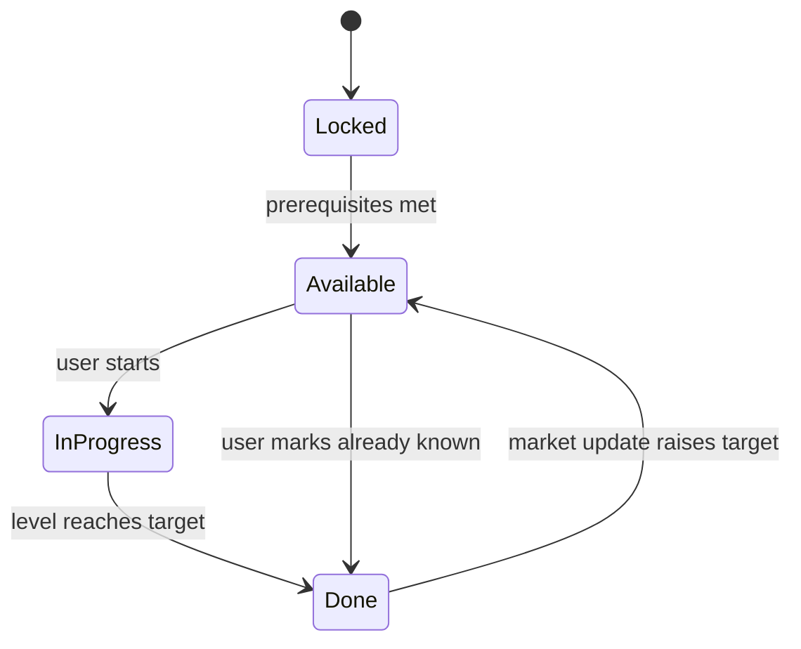
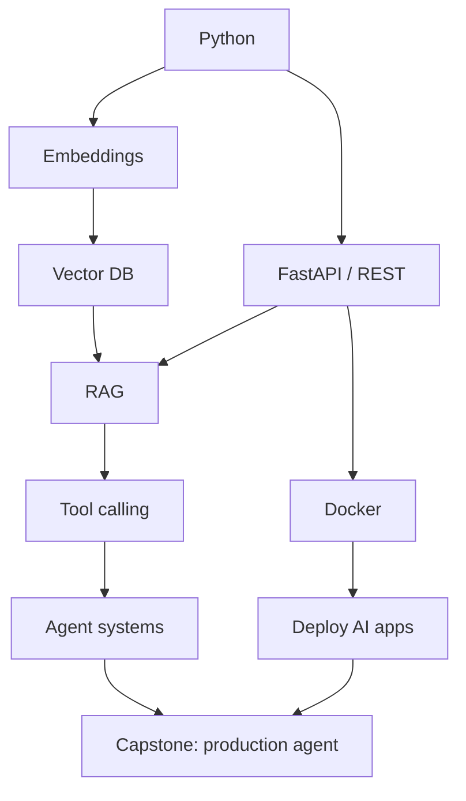
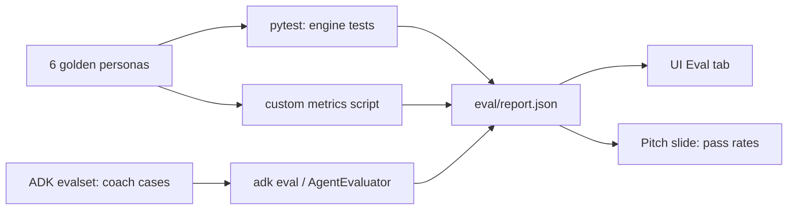

# CareerTwin — Personalized Career & Skill Navigator Agent
### 12-Hour Hackathon Build Plan (Google ADK · React · ChromaDB) — v2

> **v2 changes (nothing else changed):** multi-provider LLM chain from `.env` (§3.1) · `backend/` + `frontend/` split (§5.8) · full frozen API contract (§10) · precise priority normalization, phase rule and prerequisite-implication rule (§7) · two-team schedule mapped to the prompt phases (§14). Use this file as `docs/SPEC.md`.

> **One line:** Profile → Gaps → Roadmap → Learn → Track → **Replan**. The loop is the product.
> **Core principle:** *LLM for language, code for logic.* Everything that decides gaps, priorities and ordering is deterministic and tested. The LLM parses, personalizes and explains.

---

## 0. TL;DR

| Decision | Choice |
|---|---|
| Agent framework | **Google ADK (Python)** — see §3 |
| Backend (`backend/`) | Python · FastAPI wrapping ADK Runner + a pure-Python **Career Engine** |
| Frontend (`frontend/`) | React + Vite + TypeScript + Tailwind + Recharts + React Flow, Zustand, React Router |
| Vector DB | **ChromaDB** (local, persistent) |
| Storage | SQLite (app data) + JSON seed files (skills, roles, resources) |
| LLM | **Multi-provider, all from `.env`:** Gemini, Groq, OpenRouter (free models) with automatic failover, then deterministic fallback (§3.1) |
| Differentiators | ① deterministic testable engine ② replan **diff** ③ built-in **Eval tab** ④ grounded explanations ⑤ custom role + "market update" |

**Never cut:** engine · replan diff · explanations · eval tab.
**Cut first (in order):** diagnostic quiz → chat coach polish → custom role → market update UI.

---

## 1. Requirements → Features (traceability)

| # | Core requirement | Our feature | Where |
|---|---|---|---|
| 1 | Structured profile | Profile form + resume upload → evidence-backed skill levels | §6, §8 |
| 2 | Select/define target role | 4 curated roles + **custom role builder** (grounded in skill catalog) | §6 |
| 3 | Skills required for role | `roles.json` weights over a global skill DAG | §6 |
| 4 | Compare current vs target | Gap engine: `gap = target − level` | §7 |
| 5 | Identify + prioritize gaps | `priority = importance × gap × dependency_impact × interest_boost` | §7 |
| 6 | Personalized roadmap | Prereq-closure + topological schedule packed into weekly hours | §7 |
| 7 | Recommend courses/projects/certs | ChromaDB retrieval filtered by skill + level band | §9 |
| 8 | Track completion, update roadmap | Mark complete → level gain → replan | §7 |
| 9 | Adapt to progress & changing requirements | Replan diff + **Market Update** (role version bump) | §7 |
| 10 | Explanations | Structured `why` object + LLM narrative validated against facts | §12 |

---

## 2. Judging Metrics → How We Score AND Prove It

| Metric | What we build | Proof shown to judges |
|---|---|---|
| **Skill-gap accuracy** | Evidence-calibrated levels (resume evidence + self-rating), deterministic gap math | Precision/Recall@3 vs. hand-labeled personas (Eval tab) |
| **Personalization** | Interests, experience, weekly hours, deadline all change output | Two personas, same role → different roadmaps (Jaccard distance metric) |
| **Roadmap quality** | Prereq-aware topological order, phases, hour budget, completion criteria | "0 prerequisite violations" test + visual dependency graph |
| **Adaptability** | Replan engine + diff banner + market update | Before/after diff on stage; adaptability test suite |
| **Recommendation relevance** | Level-band filtered retrieval, verified resource catalog | Skill-match 100%, level-band ≥ 90% |
| **Explainability** | Every item has `why` = level, target, dependency, role importance | Schema completeness + numeric-consistency check |

> Most teams will *claim* quality. We show a **pass-rate dashboard**. That is the winning move.

---

## 3. Framework Decision: Google ADK vs LangChain/LangGraph

| Criterion | Google ADK | LangChain / LangGraph |
|---|---|---|
| Built-in eval | ✅ evalsets, `adk eval`, `AgentEvaluator` for pytest, eval UI in `adk web` | ❌ needs LangSmith (cloud) or custom harness |
| Dev/debug UI | ✅ `adk web` with traces | ⚠️ LangGraph Studio / LangSmith |
| Orchestration | `SequentialAgent`, `ParallelAgent`, `LoopAgent`, custom `BaseAgent` | Very flexible graph, more boilerplate |
| Tools | Plain Python functions with docstrings | Similar |
| State/sessions | Session state + `output_key`, DB session service | Checkpointers |
| Ecosystem/integrations | Smaller | Huge |
| Fit with Antigravity/Gemini | Native (same vendor) | Works, less natural |
| Risk | Younger, API drift between versions | Mature but heavy |

**Verdict: use ADK.** The problem statement is judged on *measurable quality*, and ADK gives us evaluation for free. We don't need LangChain's integration breadth.

**Caveats (handle upfront):**
1. **Pin the version** (`pip freeze`). ADK has moved fast (a 2.x line exists); copy patterns from the docs of *your installed version*, not from memory or this file's snippets.
2. **Run `adk eval` on Gemini** (`LLM_PROVIDER_CHAIN=gemini`). Groq/OpenRouter go through LiteLLM, where trajectory scoring has had reported issues; they exist for runtime failover, not for eval.
3. **Keep the Career Engine framework-independent** (pure Python + pytest). If ADK misbehaves at hour 8, the product still works.
4. Free-tier rate limits: cache LLM outputs per (profile hash, role), use the provider chain (§3.1) and keep deterministic fallbacks (§16).

---

## 3.1 LLM Providers (multi-provider, `.env`-driven)

Providers can fail mid-demo (rate limits, outages, malformed JSON). The model layer is therefore a **chain**, configured only in `backend/.env`:

| Provider | Access via | Env vars |
|---|---|---|
| Gemini | native ADK Gemini model string | `GEMINI_API_KEY`, `GEMINI_MODEL` |
| Groq | ADK `LiteLlm(model="groq/<model>")` | `GROQ_API_KEY`, `GROQ_MODEL` |
| OpenRouter (free models) | ADK `LiteLlm(model="openrouter/<model>")` | `OPENROUTER_API_KEY`, `OPENROUTER_MODEL` |

- `LLM_PROVIDER_CHAIN=gemini,groq,openrouter`: tried in order; providers without a key are skipped. `LLM_PROVIDER_CHAIN=none` means fully deterministic mode (no LLM calls), used by tests and as the last-resort fallback.
- **Failover unit = one LLM step** (ProfileAgent, ExplainerAgent, CoachAgent, RoleBuilderAgent). On timeout / rate limit / provider error / unparseable output: 1 retry on the same provider → next provider → deterministic fallback.
- Agents are built by **factories that take a model** (`build_profile_agent(model)`), so failover just rebuilds the agent with the next provider.
- **Structured output on free models is unreliable.** Every LLM step asks for JSON, parses tolerantly (strips code fences), validates with Pydantic, retries once, else moves down the chain.
- Responses carry `meta.llm_provider` / `meta.fallback_used` (§10) and `/health` lists the chain, so you can see during the demo what is serving.
- Model IDs change often, especially free ones: verify the IDs in `.env` on each provider's site before the event. No model name is hard-coded anywhere in code.
- `adk eval` runs on Gemini only (caveat 2 above).

**Deterministic fallbacks (every LLM step has one):**

| LLM step | Fallback when all providers fail or chain is `none` |
|---|---|
| ProfileAgent | Alias-match heuristic over resume text (via the Chroma skill normalizer); evidence capped at 7 |
| ExplainerAgent | Template narratives built from the structured `why` facts (§12) |
| CoachAgent | Keyword/regex intent router that calls the same tools |
| RoleBuilderAgent | Nearest curated role (Chroma similarity) cloned under the new title |

---

## 4. Scope (MoSCoW)

**MUST (core loop):**
- Profile form + resume PDF → structured skills with evidence
- 4 roles × ~15–18 skills each, over one ~60-skill catalog DAG
- Gap analysis + prioritization + readiness score
- Roadmap (phases, weeks, hours, prerequisites, activities, completion criteria)
- Mark complete → replan → **diff**
- "What should I do today?"
- Explanations on every item
- Eval harness + Eval tab

**SHOULD:**
- Custom role builder (LLM picks from catalog only)
- Market Update (load `roles` v2 → replan)
- Coach chat via ADK root agent (natural-language → tools)
- Dependency graph view

**COULD:** 3-question diagnostic per skill to calibrate self-ratings · export roadmap as PDF/ICS

**WON'T:** auth, social, job portal, scraping, own ML model, 20 roles, LMS, 3D UI.

---

## 5. Architecture

### 5.1 System



### 5.2 Agents (only 4 LLM-facing + 1 deterministic)

| Agent | Type | Job | Output |
|---|---|---|---|
| **ProfileAgent** | `LlmAgent` + `output_schema` | Resume/form text → skills with `evidence_level` + short snippet | Pydantic `ProfileOut` |
| **EngineAgent** | custom `BaseAgent` (no LLM) | Calls engine: gaps → priorities → roadmap → retrieval | JSON in session state |
| **ExplainerAgent** | `LlmAgent` + `output_schema` | Writes `why` narrative **from facts only** | `list[Why]` |
| **CoachAgent** | `LlmAgent` + tools (root) | NL interface: complete, today, why, switch role, market update | tool calls + reply |
| *(optional)* **RoleBuilderAgent** | `LlmAgent` + `output_schema` | Custom role → skills chosen **only from catalog IDs** | draft role JSON |

> ADK note: an agent with `output_schema` generally cannot call tools — keep ProfileAgent/ExplainerAgent tool-free and let the pipeline pass data via `output_key` / state.

### 5.3 Initial analysis pipeline



### 5.4 The adaptive loop (this is the pitch slide)



### 5.5 Replan sequence (the demo moment)



### 5.6 Skill status lifecycle



### 5.7 Example dependency graph (GenAI Engineer, partial)



### 5.8 Repo layout (two folders, one contract)

```
careertwin/
├─ docs/
│  ├─ SPEC.md                    # this file (source of truth)
│  ├─ AGENTS.md                  # rules for Antigravity (see §17)
│  ├─ CONTRACT_ISSUES.md         # contract problems log (§10.6)
│  └─ sample_responses/          # real API output, used to refresh mocks
├─ backend/                      # BACKEND TEAM
│  ├─ .env.example  requirements.txt  Makefile
│  ├─ app/        main.py  config.py  errors.py  schemas.py  services.py  mappers.py
│  ├─ api/        routes_health / roles / profile / analyze / progress / today / market / coach / eval
│  ├─ data/       skills.json  roles.json  roles_v2.json  resources.json  personas/
│  ├─ engine/     PURE PYTHON: models catalog calibrate gaps readiness roadmap why narrative replan today market resources
│  ├─ llm/        provider.py  failover.py  parsing.py
│  ├─ agents/     profile_agent  explainer_agent  engine_agent  pipeline  role_builder_agent
│  │              coach_agent  coach_tools  validator  resume_text
│  │              navigator/agent.py   # exports root_agent for `adk web` / `adk eval`
│  │              evalsets/            # coach.evalset.json + test_config.json
│  ├─ rag/        chroma_client  indexer  normalizer  retriever
│  ├─ store/      db.py  repo.py
│  ├─ eval/       metrics.py  run_eval.py  report.json
│  ├─ scripts/    validate_data  check_links  warm_models  smoke_llm  seed_demo  verify_contract  demo_pipeline
│  └─ tests/
└─ frontend/                     # FRONTEND TEAM
   ├─ .env.example               # VITE_API_BASE_URL, VITE_USE_MOCK
   └─ src/  api/  types/  mocks/  store/  components/ui/  components/  pages/  hooks/  lib/
```

---

## 6. Data Design (grounding = accuracy)

**Rule: the LLM never invents skills, prerequisites, or resources. It only selects from and explains these files.**

### 6.1 `skills.json` — one global DAG

```json
{
  "id": "rag",
  "name": "Retrieval-Augmented Generation",
  "category": "GenAI",
  "aliases": ["RAG", "retrieval augmented generation", "vector search apps"],
  "prerequisites": [
    {"skill": "embeddings", "min_level": 4},
    {"skill": "vector_db", "min_level": 4},
    {"skill": "python", "min_level": 5}
  ],
  "hours_per_level": 6,
  "tags": ["nlp", "llm", "search"],
  "mastery_criteria": [
    "Build a RAG app over your own documents with citations",
    "Measure retrieval quality (hit rate@k) on 20 test questions"
  ]
}
```

### 6.2 `roles.json` — weights over the DAG

```json
{
  "role_id": "genai_engineer",
  "title": "GenAI Engineer",
  "version": "2026.09",
  "source": "curated from public job postings and standard curricula",
  "skills": [
    {"skill": "python", "importance": 0.95, "target": 8},
    {"skill": "rag", "importance": 0.90, "target": 7},
    {"skill": "docker", "importance": 0.70, "target": 6}
  ]
}
```
Roles (pick 4): **GenAI Engineer, ML Engineer, Backend Engineer, Data Scientist**.

### 6.3 `resources.json`

```json
{
  "id": "res_rag_001",
  "type": "course | project | doc | certification",
  "title": "…", "provider": "…", "url": "…", "verified": false,
  "skills": ["rag"],
  "level_from": 3, "level_to": 6,
  "hours": 6, "level_gain": 2,
  "description": "one sentence used for embedding"
}
```
> Verify every URL by hand and flip `verified` to `true` only after checking (`scripts/check_links.py` helps). Never let the model generate links. `verified` and `capstone_for` (role_id, capstone projects only) are data-only fields and are not exposed by the API.

### 6.4 Profile (stored)

```json
{
  "education": {"degree": "B.Tech CSE", "year": 3},
  "experience_years": 1,
  "interests": ["LLMs", "backend"],
  "goal": {"role_id": "genai_engineer", "deadline_weeks": 12},
  "weekly_hours": 10,
  "skills": {
    "docker": {"self": 6, "evidence": 3, "level": 4.2, "flag": "unverified"}
  }
}
```

### 6.5 Roadmap item

```json
{
  "item_id": "rm_07", "skill": "docker", "phase": "Applied", "week": 4,
  "hours": 8, "status": "available",
  "prerequisites": ["linux_basics"],
  "activities": ["res_docker_002", "res_docker_proj_001"],
  "completion_criteria": ["Containerize the FastAPI app", "docker compose up runs the full stack"],
  "why": {
    "level": 4.2, "target": 6, "gap": 1.8, "importance": 0.70,
    "unblocks": ["deploy_ai_apps"], "priority": 74,
    "narrative": "…"
  }
}
```

### 6.6 SQLite tables
`users` · `profiles(user_id, json)` · `roadmaps(user_id, version, json)` · `progress_events(user_id, ts, type, payload)` · `role_versions(role_id, version, json)`

---

## 7. Algorithms (write these first, test them first)

### 7.1 Level calibration (Skill-Gap Accuracy)
Self-ratings are unreliable; resumes give evidence.
```
if evidence and self:  level = 0.6*evidence + 0.4*self
elif evidence:         level = evidence
else:                  level = self * 0.7          # unverified self-claim discounted
flag "unverified" if self - evidence >= 3
```
`evidence_level` (0–10) comes from ProfileAgent using explicit signals: years, project count, depth keywords, and a short supporting snippet shown in the UI.

### 7.2 Gap & priority
```
gap              = max(0, target - level)
dependency_impact= 1 + 0.5 * sum(importance(d) for d in dependents(s) if gap(d) > 0)
interest_boost   = 1 + 0.2 * (skill.tags ∩ user.interests > 0)
raw_priority     = importance * gap * dependency_impact * interest_boost
priority         = round(100 * raw_priority / max(raw_priority over current gaps))   # relative, 0-100
label            = Critical (>=75) | High (50-74) | Medium (25-49) | Low (<25)
# dependents(s) counts only skills of the current role that still have a gap; interest_boost applies when skill.tags intersect user interests
```

### 7.3 Readiness (skill-alignment score, **not** a hiring prediction)
```
readiness = 100 * Σ importance_s * min(level_s, target_s)/target_s  /  Σ importance_s
```
Show category sub-scores (Foundations, ML, GenAI, Deployment). State clearly in the UI: *"measures alignment with role requirements, not job outcome."*

### 7.4 Roadmap generation
1. **Candidates** = skills with gap > 0.
2. **Prerequisite closure**: add any prerequisite whose `min_level` isn't met, even if not a role skill.
3. **Topological order** (Kahn) with max-heap on `priority` as tie-breaker.
4. **Hours** = `gap × hours_per_level × experience_multiplier` (beginner 1.2, experienced 0.85).
5. **Pack into weeks** sequentially by `weekly_hours` (an item may span weeks: `week_start`..`week_end`); group into phases: *Foundation* (depth 0 in the roadmap DAG) → *Core* (depth 1–2) → *Applied* (depth ≥ 3 or category Deployment) → *Capstone* (final item).
6. **Attach activities** from ChromaDB (§9) and `mastery_criteria` as completion criteria.
7. **Capstone** = one project combining the top-3 role skills.
8. If total weeks > `deadline_weeks`: mark overflow items "stretch" and say so.

### 7.5 Replan on completion
```
on complete(skill):       level[skill] = target; each prerequisite level = max(level, min_level)   # mastery implies prerequisites
on complete(activity):    level[skill] = min(10, level[skill] + activity.level_gain)   # skill is done when level >= target
on mark_known(skill, n):  level[skill] = n
then: recompute gaps → priorities → readiness → schedule (completed items frozen)
then: DIFF = {level_changes, unlocked, removed, reordered, readiness_before/after}
```
Honesty note: completing RAG doesn't magically lower the *Agents* gap (it only raises RAG's own prerequisites to their required minimums). It **unlocks** Agents (prereq met) and changes priority/ordering. Say exactly that in the UI. Judges notice fake logic.

### 7.6 Market Update (changing requirements)
Load `roles_v2.json` (e.g., add **MCP** at importance 0.6, raise `evaluation` target 5 → 7, lower a legacy skill). Engine diffs role versions → replans → shows *"3 new/changed requirements → 2 new roadmap items, 1 reprioritized"*.

### 7.7 Today's priority
First `available` (prereqs met) item by priority that fits a 60–120 min slot → return one activity + why.

---

## 8. ADK Implementation Sketches

> Sketches only. Verify class names/args against your installed ADK version.

```python
# agents/profile_agent.py
from google.adk.agents import LlmAgent
from pydantic import BaseModel

class SkillEvidence(BaseModel):
    skill_name: str
    evidence_level: float      # 0-10
    snippet: str               # <=15 words from the resume

class ProfileOut(BaseModel):
    education: str
    experience_years: float
    interests: list[str]
    skills: list[SkillEvidence]

profile_agent = LlmAgent(
    name="ProfileAgent",
    model=get_model(provider),         # provider factory, driven by .env (§3.1)
    instruction=PROFILE_PROMPT,        # rubric for evidence_level; never invent skills
    output_schema=ProfileOut,          # tool-free agent
    output_key="profile_raw",
)
```

```python
# agents/engine_agent.py  — deterministic step inside the pipeline
from google.adk.agents import BaseAgent

class EngineAgent(BaseAgent):
    async def _run_async_impl(self, ctx):
        s = ctx.session.state
        result = engine.analyze(s["profile_raw"], s["goal"], s["weekly_hours"])
        # yield an Event carrying state_delta={"gaps":..., "roadmap":...}
        ...
```

```python
# agents/pipeline.py
from google.adk.agents import SequentialAgent
analysis = SequentialAgent(
    name="AnalysisPipeline",
    sub_agents=[profile_agent, EngineAgent(name="EngineAgent"), explainer_agent],
)
```

```python
# agents/coach_agent.py  — root agent: natural language → engine tools
def mark_complete(skill_id: str, tool_context) -> dict:
    """Mark a skill or activity as completed and replan. Returns the diff."""
def get_today_priority(tool_context) -> dict:
    """Return the single best activity to do today, with reasons."""
def explain_item(item_id: str, tool_context) -> dict:
    """Return the structured 'why' for a roadmap item."""
def set_target_role(role_id: str, tool_context) -> dict: ...
def apply_market_update(tool_context) -> dict: ...

coach_agent = LlmAgent(
    name="CoachAgent", model=get_model(provider),
    instruction="Use tools for every fact. Never invent skills, levels or links.",
    tools=[mark_complete, get_today_priority, explain_item, set_target_role, apply_market_update],
)
```

**Two paths, one engine:**
- **UI buttons** → FastAPI → engine tool functions directly (fast, deterministic, demo-safe).
- **Coach chat** → ADK root agent → the *same* tool functions (this path is what `adk eval` tests).

Sessions: ADK's DB session service on SQLite if convenient; **source of truth stays in our own tables**.

**Provider factory (llm/provider.py):**
```python
from google.adk.models.lite_llm import LiteLlm
def get_model(provider: str):
    if provider == "gemini":     return settings.GEMINI_MODEL                        # native ADK Gemini
    if provider == "groq":       return LiteLlm(model=f"groq/{settings.GROQ_MODEL}")
    if provider == "openrouter": return LiteLlm(model=f"openrouter/{settings.OPENROUTER_MODEL}")
# agents come from factories: build_profile_agent(model), build_explainer_agent(model), build_coach_agent(model)
# llm/failover.py: run_with_failover(step, make_call, chain) -> (result, provider) or AllProvidersFailed
```
ADK reads `GOOGLE_API_KEY` for Gemini: `config.py` maps `GEMINI_API_KEY` to it. LiteLLM reads `GROQ_API_KEY` / `OPENROUTER_API_KEY` directly. Verify against your installed versions.

---

## 9. ChromaDB — Two Real Jobs

1. **Skill normalization** (collection `skills`): embed `name + aliases`. Map resume text like "ReactJS", "LLM apps", "vector search" to canonical IDs. Threshold + fallback to "unmapped" (shown to user, not silently dropped).
2. **Resource retrieval** (collection `resources`): embed `title + description`. Query = `"{skill} {user interests} {level band}"` with metadata filters `skills ∋ skill` and `level_from ≤ user_level ≤ level_to`. Diversify: at least one course + one project per skill; certification only if role marks it valued.

**Offline tip:** use Chroma's default embedding function (ONNX MiniLM), pre-download it with `scripts/warm_models.py` before the event, and persist the DB in `./chroma_data`. Venue Wi-Fi is not a dependency.

**Implementation note:** Chroma metadata cannot hold lists, so `resources` is indexed as **one record per (resource, skill) pair** with metadata `resource_id, skill_id, type, level_from, level_to`; retrieval filters on `skill_id` and the level band, then widens the band by ±1 if too few results.

---

## 10. API Contract (single source of truth — FROZEN after hour 1)

Backend implements it, frontend consumes it, and **both derive their types from §10.2**:
`backend/app/schemas.py` (Pydantic v2) and `frontend/src/types/api.ts` (TypeScript). If anything here changes, this section, both files and the frontend mocks change **in one commit, agreed by both teams** (§10.6).

### 10.1 Conventions
- Base URL `http://localhost:8000/api` · JSON (UTF-8) · `snake_case` keys · CORS origins from `CORS_ORIGINS`.
- Single demo user. Optional header `X-User-Id` (default `demo`); the frontend always sends `demo`.
- Numbers: `level` / `target` / `gap` 0–10 (1 decimal) · `importance` 0–1 (2 decimals) · `priority` 0–100 integer · `readiness` 0–100 (1 decimal).
- IDs: `skill_id` = snake_case id from `skills.json` · `role_id` from `roles.json` (custom roles: `custom_<slug>`) · `item_id` = `rm_<skill_id>` (capstone: `rm_capstone`), **stable across replans** so diffs can reference them · `activity_id` = resource id.
- Every state-changing call creates a new roadmap `version` (int, +1) and returns the full new state.
- `meta` appears on every response that can involve an LLM: `llm_provider` = provider that produced any LLM output in this request (`"none"` if none) · `llm_used` = at least one LLM output was used · `fallback_used` = at least one deterministic fallback replaced an LLM output.
- HTTP codes: 200 success · 400 precondition failed (`NO_PROFILE`, `NO_ROADMAP`) · 404 unknown id / not found · 409 conflict · 422 validation · 500 internal · 501 not implemented yet · 503 `LLM_UNAVAILABLE` (only when no fallback exists).

### 10.2 Types (TypeScript notation; Pydantic mirrors it 1:1)

```ts
// ---------- shared ----------
type Provider = "gemini" | "groq" | "openrouter" | "none";
interface Meta { llm_provider: Provider; llm_used: boolean; fallback_used: boolean }
type SkillStatus = "locked" | "available" | "in_progress" | "done";
type PriorityLabel = "Critical" | "High" | "Medium" | "Low";     // >=75 / 50-74 / 25-49 / <25
type Phase = "Foundation" | "Core" | "Applied" | "Capstone";
type ActivityType = "course" | "project" | "doc" | "certification";
type NarrativeSource = "llm" | "template";
interface SkillRef { skill_id: string; skill_name: string }
interface RoleRef { role_id: string; title: string; version: string }

// ---------- profile ----------
interface ProfileInput {                       // JSON string in multipart field "data"
  education: { degree: string; year: number | null };
  experience_years: number;
  interests: string[];
  self_skills: { name: string; self: number }[];   // self 0-10
  resume_text: string | null;                      // alternative to PDF upload
}
interface ProfileSkill {
  skill_id: string; skill_name: string;
  self: number | null; evidence: number | null; level: number;
  flag: "unverified" | null; snippet: string | null;
  source: "resume" | "self" | "resume+self" | "override";
}
interface Profile {
  education: { degree: string; year: number | null };
  experience_years: number; interests: string[];
  weekly_hours: number; deadline_weeks: number;    // defaults 10 / 12 until /analyze sets them
  target_role_id: string | null;
  skills: ProfileSkill[]; unmapped_skills: string[];
}
interface ProfileResponse { profile: Profile; meta: Meta }

// ---------- roles ----------
interface RoleSkill { skill_id: string; skill_name: string; category: string; importance: number; target: number }
interface RoleSummary {
  role_id: string; title: string; version: string; description: string;
  skill_count: number; top_skills: string[];       // top 5 skill names by importance
  is_custom: boolean; market_update_available: boolean;
}
interface RoleDetail extends RoleSummary { skills: RoleSkill[] }
interface RolesResponse { roles: RoleSummary[] }
interface CustomRoleRequest { title: string; description: string }
interface CustomRoleResponse { role: RoleDetail; meta: Meta }

// ---------- analysis ----------
interface AnalyzeRequest {
  role_id: string; weekly_hours: number; deadline_weeks: number;
  skill_overrides?: Record<string, number>;        // skill_id -> level 0-10 (user corrections)
}
interface CategoryScore { category: string; score: number }
interface Gap {
  skill_id: string; skill_name: string; category: string;
  level: number; target: number; gap: number; importance: number;
  dependency_impact: number; priority: number; priority_label: PriorityLabel;
  status: SkillStatus; flag: "unverified" | null; unblocks: SkillRef[];
}
interface Strength { skill_id: string; skill_name: string; level: number; target: number }
interface RadarPoint { skill_id: string; skill_name: string; current: number; target: number }
interface Analysis {
  readiness: number; readiness_note: string;       // "skill-alignment score, not a hiring prediction"
  category_scores: CategoryScore[];
  gaps: Gap[];                                     // sorted by priority desc
  strengths: Strength[]; radar: RadarPoint[];      // radar = top 8 role skills
}

// ---------- roadmap ----------
interface Why {
  level: number; target: number; gap: number; importance: number;
  priority: number; priority_label: PriorityLabel;
  unblocks: SkillRef[]; interest_match: boolean; evidence_snippet: string | null;
  narrative: string; narrative_source: NarrativeSource;
}
interface Prereq { skill_id: string; skill_name: string; min_level: number; met: boolean }
interface Activity {
  activity_id: string; type: ActivityType; title: string; provider: string; url: string;
  hours: number; level_gain: number; skills: string[]; level_from: number; level_to: number;
  completed: boolean;
}
interface RoadmapItem {
  item_id: string; position: number;               // 1-based order
  skill_id: string | null;                         // null for capstone
  skill_name: string; phase: Phase;
  week_start: number; week_end: number; hours: number;
  status: SkillStatus; stretch: boolean;           // stretch = ends after deadline_weeks
  is_capstone: boolean; combines: SkillRef[];      // capstone only, else []
  prerequisites: Prereq[]; activities: Activity[]; completion_criteria: string[];
  why: Why | null;                                 // null only for capstone
}
interface GraphNode { id: string; label: string; status: SkillStatus; phase: Phase }
interface GraphEdge { source: string; target: string }   // prerequisite -> dependent
interface Roadmap {
  version: number; total_weeks: number; total_hours: number;
  deadline_weeks: number; weekly_hours: number;
  phases: Phase[]; items: RoadmapItem[];
  graph: { nodes: GraphNode[]; edges: GraphEdge[] };
}
interface AnalyzeResponse { role: RoleRef; analysis: Analysis; roadmap: Roadmap; meta: Meta }

// ---------- progress / replan ----------
interface CompleteRequest { skill_id: string; activity_id?: string | null }  // no activity_id = whole skill
interface KnownRequest { skill_id: string; level: number }
interface Diff {
  trigger: { type: "complete_skill" | "complete_activity" | "mark_known" | "market_update";
             skill_id: string | null; skill_name: string | null; activity_id?: string | null };
  readiness_before: number; readiness_after: number;
  level_changes: { skill_id: string; skill_name: string; from: number; to: number }[];
  unlocked: SkillRef[];
  removed: { item_id: string; skill_name: string; reason: string }[];
  added: { item_id: string; skill_name: string; reason: string }[];
  reordered: { item_id: string; skill_name: string; from_position: number; to_position: number }[];
  reprioritized: { skill_id: string; skill_name: string; from_priority: number; to_priority: number }[];
  requirement_changes: { skill_id: string; skill_name: string;
        change: "added" | "removed" | "importance_changed" | "target_changed";
        from: number | null; to: number | null }[];   // market update only, else []
  facts: string[];                                 // deterministic one-line sentences, always present
}
interface ProgressResponse {
  state: AnalyzeResponse; diff: Diff;
  narrative: string; narrative_source: NarrativeSource; meta: Meta;
}
interface MarketUpdateRequest { role_id: string | null }   // null = current target role

// ---------- today ----------
interface TodayPick {
  item_id: string; skill_id: string; skill_name: string;
  activity: Activity; minutes: number; why: Why; reasons: string[];
}
interface TodayResponse { today: TodayPick | null; message: string | null; meta: Meta }

// ---------- coach ----------
interface CoachRequest { message: string; session_id: string }
interface ToolCallInfo { name: string; args: Record<string, unknown>; ok: boolean }
interface CoachResponse {
  reply: string; tool_calls: ToolCallInfo[];
  state_changed: boolean; state: AnalyzeResponse | null; diff: Diff | null; meta: Meta;
}

// ---------- eval ----------
type EvalCategory = "Skill-Gap Accuracy" | "Personalization" | "Roadmap Quality"
                  | "Adaptability" | "Recommendation Relevance" | "Explainability";
interface EvalMetric {
  id: string; name: string; category: EvalCategory;
  value: number; target: number; comparator: ">=" | "<=" | "==";
  unit: "ratio" | "count" | "percent"; passed: boolean;
}
interface EvalPersona {
  persona_id: string; name: string; role_id: string;
  expected_top_gaps: string[]; predicted_top_gaps: string[];
  precision_at_3: number; recall_at_3: number;
}
interface AdkEval {
  ran_at: string | null;
  tool_trajectory_avg_score: number | null; response_match_score: number | null;
  cases: { eval_id: string; passed: boolean; tool_trajectory: number | null }[];
}
interface EvalReport {
  generated_at: string;
  summary: { total: number; passed: number; pass_rate: number };
  metrics: EvalMetric[]; personas: EvalPersona[]; adk: AdkEval;
}

// ---------- health & errors ----------
interface Health { status: "ok"; version: string; llm: { chain: Provider[]; primary: Provider };
                   chroma: "ok" | "error"; db: "ok" | "error" }
type ErrorCode = "VALIDATION_ERROR" | "NO_PROFILE" | "NO_ROADMAP" | "UNKNOWN_ROLE" | "UNKNOWN_SKILL"
  | "UNKNOWN_ACTIVITY" | "RESUME_PARSE_ERROR" | "NO_MARKET_UPDATE" | "EVAL_NOT_RUN"
  | "LLM_UNAVAILABLE" | "NOT_IMPLEMENTED" | "INTERNAL_ERROR";
interface ApiErrorEnvelope { error: { code: ErrorCode; message: string; details?: Record<string, unknown> } }
```

### 10.3 Endpoints (13)

| # | Method | Path | Request | Response | Errors |
|---|---|---|---|---|---|
| 1 | GET | `/health` | — | `Health` | — |
| 2 | GET | `/roles` | — | `RolesResponse` (4 curated + saved custom) | — |
| 3 | POST | `/roles/custom` | `CustomRoleRequest` | `CustomRoleResponse` | 422 |
| 4 | POST | `/profile` | `multipart/form-data`: `data` = JSON string of `ProfileInput`; `resume` = optional PDF | `ProfileResponse` | `RESUME_PARSE_ERROR`, 422 |
| 5 | GET | `/profile` | — | `ProfileResponse` | `NO_PROFILE` |
| 6 | POST | `/analyze` | `AnalyzeRequest` | `AnalyzeResponse` | `NO_PROFILE`, `UNKNOWN_ROLE`, `UNKNOWN_SKILL`, 422 |
| 7 | GET | `/roadmap` | — | `AnalyzeResponse` (latest state) | `NO_ROADMAP` |
| 8 | POST | `/progress/complete` | `CompleteRequest` | `ProgressResponse` | `NO_ROADMAP`, `UNKNOWN_SKILL`, `UNKNOWN_ACTIVITY` |
| 9 | POST | `/progress/known` | `KnownRequest` | `ProgressResponse` | `NO_ROADMAP`, `UNKNOWN_SKILL`, 422 |
| 10 | GET | `/today` | — | `TodayResponse` | `NO_ROADMAP` |
| 11 | POST | `/market/update` | `MarketUpdateRequest` | `ProgressResponse` | `NO_ROADMAP`, `NO_MARKET_UPDATE`, `UNKNOWN_ROLE` |
| 12 | POST | `/coach` | `CoachRequest` | `CoachResponse` | `NO_ROADMAP`, `NOT_IMPLEMENTED` |
| 13 | GET | `/eval/report` | — | `EvalReport` | `EVAL_NOT_RUN` |

Error body example (all errors use this envelope):
```json
{ "error": { "code": "NO_PROFILE", "message": "Create a profile first (POST /profile).", "details": {} } }
```

`Diff` example (after completing `rag`):
```json
{
  "trigger": { "type": "complete_skill", "skill_id": "rag", "skill_name": "RAG" },
  "readiness_before": 58.2, "readiness_after": 66.4,
  "level_changes": [ { "skill_id": "rag", "skill_name": "RAG", "from": 4.0, "to": 7.0 },
                     { "skill_id": "vector_db", "skill_name": "Vector DBs", "from": 3.0, "to": 4.0 } ],
  "unlocked": [ { "skill_id": "tool_calling", "skill_name": "Tool calling" } ],
  "removed": [ { "item_id": "rm_vector_db", "skill_name": "Vector DBs", "reason": "Only needed as a prerequisite for RAG, which is complete" } ],
  "added": [],
  "reordered": [ { "item_id": "rm_tool_calling", "skill_name": "Tool calling", "from_position": 6, "to_position": 3 } ],
  "reprioritized": [ { "skill_id": "docker", "skill_name": "Docker", "from_priority": 74, "to_priority": 61 } ],
  "requirement_changes": [],
  "facts": ["RAG completed: level 4.0 → 7.0", "Tool calling is now unlocked", "Readiness 58.2 → 66.4"]
}
```

### 10.4 Flow and behaviour rules
- Order of calls: `POST /profile` → `POST /analyze` → everything else. `GET /roles` and `GET /health` work any time.
- `POST /analyze` may be called again (e.g., after a role change): it rebuilds the roadmap from the profile, bumps `version`, and clears completed activities.
- `skill_overrides` beat calibrated levels (`source` becomes `"override"`).
- `POST /progress/complete` without `activity_id` completes the whole skill (level = target, and each prerequisite is raised to at least its `min_level`, see §7.5). With `activity_id`, level += that activity's `level_gain`. Repeating an action is idempotent: `200`, empty diff, `facts: ["Already complete"]`.
- `POST /market/update` is available only when the role's `market_update_available` is true; afterwards it becomes false.
- `POST /coach` may change state; if so `state_changed` is true and `state` (+ `diff` when relevant) is included so the UI updates without another call.
- `GET /eval/report` serves `backend/eval/report.json` written by `make eval`.
- Nothing in a response is computed by the frontend; the frontend renders what it receives.

### 10.5 Mock parity
`frontend/src/mocks/` fixtures are typed with §10.2 and are replaced by `docs/sample_responses/*.json` (real backend output) once `make verify` is green.

### 10.6 Contract governance
Frozen after hour 1. A change needs: (1) an entry in `docs/CONTRACT_ISSUES.md`, (2) both team leads' agreement, (3) one commit updating §10.2, `schemas.py`, `api.ts` and mocks. Additions made in v2 relative to v1: `GET /health`, `GET /profile`, `RoleSummary.top_skills`, `RoleSummary.market_update_available`, `Diff.facts`, `meta`.

---

## 11. UI — 6 Screens

**Frontend stack:** React 18 + Vite + TypeScript (strict) + Tailwind · React Router · Zustand · Recharts · `@xyflow/react` (React Flow) · lucide-react. All HTTP goes through `src/api/client.ts`; `VITE_USE_MOCK=true` serves typed fixtures so the frontend team works without the backend. Routes: `/`, `/profile`, `/analysis`, `/roadmap`, `/progress`, `/eval`.

1. **Landing** — one CTA.
2. **Profile** — form + resume upload → extracted skills as editable chips with evidence snippets (user can correct levels).
3. **Analysis** — readiness gauge, radar (current vs target), gap bars sorted by priority, "top 3 gaps and why".
4. **Roadmap** — phases/weeks timeline + React Flow dependency graph; item drawer with resources, criteria, **Why?**.
5. **Progress** — "Mark complete", **diff banner**, Today card, market-update button.
6. **Eval** — pass rates per metric, persona table, ADK trajectory score.

```
┌────────────────────────────────────────────────────────┐
│ Target: GenAI Engineer            Readiness  58% ▲ +8  │
│ ███████████░░░░░░░░                                    │
├───────────────────────────┬────────────────────────────┤
│ TOP GAPS (priority)       │ TODAY                      │
│ 1 Docker        ████ 74   │ Agent Tool Calling · 90m   │
│ 2 Evaluation    ███  61   │ Why: unlocks Agents, gap   │
│ 3 Vector DB     ███  55   │ 4→7, importance 0.85       │
│                           │ [ Start ]                  │
├───────────────────────────┴────────────────────────────┤
│ CHANGES SINCE LAST PLAN                                │
│ ✓ RAG completed  → Agents unlocked                     │
│ − removed: RAG intro course, RAG mini-project          │
│ ↕ Tool Calling moved ahead of Docker                   │
└────────────────────────────────────────────────────────┘
```

Design rules: loading skeletons, clear error toasts, every number clickable to its "why".

---

## 12. Explainability Spec

Each item carries a **structured why** (computed) + **narrative** (LLM, constrained):

```
Structured: level, target, gap, importance, unblocks[], priority, interest_match, evidence_snippet
Narrative template the LLM must follow:
  "{Skill} is {priority label} because your level is {level}/10 vs ~{target}/10 needed for {role}.
   It also unblocks {unblocks}. {interest/experience personalization}."
```
**Validator:** extract all numbers from the narrative → must match structured facts. On mismatch or LLM failure → template fallback (same sentence, no LLM). Explanations therefore never contradict the scoring.

---

## 13. Evaluation Harness (our second product)

### 13.1 Golden personas (6, hand-labeled)

| Persona | Role | Expected top gaps (labeled) | Tests |
|---|---|---|---|
| P1 Strong Python, weak deployment | GenAI Eng | Docker, Evaluation, Vector DB | Gap accuracy |
| P2 CS student, beginner | GenAI Eng | Embeddings, APIs, Python depth | Foundation ordering |
| P3 Backend dev | ML Eng | Statistics, ML fundamentals, PyTorch | Cross-role transfer |
| P4 Data analyst | Data Scientist | Modeling, ML, experimentation | Personalization |
| P5 Experienced ML eng | GenAI Eng | Agents, RAG eval | Short roadmap |
| P6 Meets all targets | any | none | Empty-gap edge case |

*Be transparent: labels are team-curated from role knowledge; say so in the pitch.*

### 13.2 Metrics

| Metric | Definition | Target |
|---|---|---|
| Gap Precision@3 / Recall@3 | top-3 predicted gaps vs labeled | ≥ 0.8 / ≥ 0.8 |
| Rank correlation | Kendall τ on top-5 | ≥ 0.6 |
| Prereq violations | items scheduled before unmet prereq | **0** |
| Budget compliance | weeks ≤ weekly_hours | 100% |
| Personalization distance | Jaccard distance of roadmap skill sets, same role, different personas | ≥ 0.3 |
| Strong-skill leakage | skills with gap = 0 scheduled | **0** |
| Adaptability | after completing X: X removed, readiness ↑, dependents unlocked, diff non-empty, idempotent | 100% |
| Market-update response | v2 role → new/changed items appear | 100% |
| Resource skill match | retrieved resource lists the skill | 100% |
| Level-band fit | user level ∈ [level_from, level_to] | ≥ 90% |
| Normalization hit rate | 25 alias queries ("ReactJS"→react) top-1 correct | ≥ 90% |
| Explainability completeness | all `why` fields present | 100% |
| Numeric consistency | narrative numbers = facts | 100% |
| (optional) LLM-judge | rubric 1–5 on clarity | ≥ 4 |

### 13.3 ADK evalsets (Coach path)

```
agents/evalsets/coach.evalset.json     # ~8 cases
agents/evalsets/test_config.json       # {"criteria": {"tool_trajectory_avg_score": 1.0, "response_match_score": 0.3}}
```
Cases: "I completed RAG" → `mark_complete(rag)` · "What should I learn today?" → `get_today_priority` · "Why Docker?" → `explain_item` · "Switch to ML engineer" → `set_target_role(ml_engineer)` · "Requirements changed" → `apply_market_update` · plus 3 paraphrase variants.

- `tool_trajectory_avg_score` is the important one. `response_match_score` is ROUGE-based word overlap → brittle for LLM prose, so keep the threshold low.
- Run via `adk web` (capture golden sessions), `adk eval` (CLI), or `AgentEvaluator` inside pytest. Check `adk eval --help` for exact flags in your version.

### 13.4 Eval flow


One command: `make eval` → pytest + custom metrics + adk eval → `report.json`.

---

## 14. 12-Hour Schedule (two teams: Backend = tracks A + B, Frontend = track C)

**Tracks:** **A** Engine + data + eval (BE-A) · **B** LLM/RAG/agents/API (BE-B) · **C** Frontend (FE). If the backend team is one person, run A then B in order.

| Hours | A: Engine + Data | B: Agents + RAG + API | C: Frontend |
|---|---|---|---|
| **0–1** | Freeze schemas (§6) + API contract (§10). Scaffold repo, `AGENTS.md`. Verify keys, ADK hello-world, Chroma embed works offline | ← same | ← same, scaffold Vite + **mock API** from contract |
| **1–3** | skills.json + 4 roles; gaps, readiness, calibration + **pytest** | ProfileAgent, resume PDF text extraction, Chroma skill normalization | Profile screen, role picker, Analysis screen on mock data |
| **3–5** | roadmap builder + replan + diff + today + pytest | resources.json indexing, retrieval, ExplainerAgent + validator + fallback | Roadmap timeline + item drawer |
| **5–6** | **Integration: full happy path end-to-end** (Checkpoint ①) | FastAPI wiring | Connect UI to real API |
| **6–8** | Personas + custom metrics | CoachAgent + tools + evalsets | Progress screen, diff banner, Today card, dependency graph |
| **8–9** | Market update (roles_v2) | RoleBuilderAgent (Should) | Eval tab, market-update button |
| **9–10** | Fix bugs found by eval | Cache LLM outputs, error paths | Polish, loading/error states |
| **10–11** | Seed demo user, backup demo video, rehearsal ×2 (Checkpoint ②) | ← same | ← same |
| **11–12** | **Code freeze at 11:00.** README, slides, final dry-run. No new features |

**Checkpoint ① (hour 6):** upload resume → gaps → roadmap → mark complete → diff, all real. If missed, drop Should-haves immediately.
**Checkpoint ② (hour 10):** demo runs 3× in a row without intervention.

**Prompt phases ↔ hours** (prompts are in `CareerTwin_Build_Prompts.md`):

| Hours | Backend | Frontend |
|---|---|---|
| 0–1 | Phase 0 (both), then B1 data | Phase 0 (both), then F1 |
| 1–3 | B1 finish, B2 engine core · B4 store/LLM/RAG (BE-B) | F1 finish, F2 profile |
| 3–5 | B3 roadmap/replan · B5 agents | F3 analysis, F4 roadmap |
| 5–6 | B6 API → **Checkpoint ①** · I1 verify | I2 connect to real API |
| 6–8 | B7 coach · B8 eval harness | F5 progress + coach |
| 8–9 | B9 custom role + hardening | F6 eval tab |
| 9–10 | Fix bugs found by eval, I1 re-run | F7 polish, I2 re-run |
| 10–12 | Rehearsal, backup video, **freeze at 11:00** | Rehearsal, **freeze at 11:00** |

---

## 15. Demo Script (5 min) + Pitch

| Time | Scene | What judges see |
|---|---|---|
| 0:00 | Problem | Generic advice fails: same output for everyone |
| 0:20 | Upload resume, pick **GenAI Engineer** | Extracted skills with evidence snippets; one flagged "unverified" |
| 1:00 | Analysis | Readiness 58%, radar, top-3 gaps each with *why* |
| 1:45 | Roadmap | Dependency graph, weeks sized to 10 h/week, criteria per item |
| 2:30 | **Mark RAG complete** | Diff banner: readiness 58→66, Agents unlocked, items removed, order changed |
| 3:15 | **Market update** (MCP added) | New item appears, one item reprioritized |
| 3:45 | Coach: "What should I do today?" | One activity, 90 min, structured why |
| 4:15 | **Eval tab** | Pass rates + ADK tool-trajectory score |
| 4:45 | Close | "Not a chatbot: a measurable adaptive system." Future work: live job-posting ingestion |

**Likely judge questions:**
- *"Isn't this an LLM wrapper?"* → Scoring, ordering and replanning are deterministic code with 100+ tests; LLM only parses and explains, and is validated.
- *"How do you know gap accuracy?"* → Eval tab: precision/recall on labeled personas; labels are team-curated (we say so).
- *"Where do role requirements come from?"* → Curated, versioned, provenance-tagged; market update demonstrates versioned change; live ingestion is next step.
- *"What if the LLM fails?"* → Deterministic fallbacks on every LLM step; demo works even with the model down.
- *"Does readiness predict getting hired?"* → No. It is a skill-alignment metric by design.

---

## 16. Risks & Fallbacks

| Risk | Mitigation |
|---|---|
| LLM provider rate limit / outage | Provider chain Gemini → Groq → OpenRouter (free) from `.env`; 1 retry per provider; cache by (profile hash, role); deterministic fallbacks; pre-generated demo user |
| Free models return malformed JSON or weak tool calling | Tolerant JSON parse + Pydantic validation + retry; Coach falls back to keyword router; `adk eval` only on Gemini |
| ADK API drift / bug | Engine independent of ADK; buttons bypass agents; pin version |
| Resume parsing messy | Editable extracted-skills chips; sample resumes tested in advance |
| Catalog quality is weak | Time-box 60–90 min of careful curation at start; quality here drives every metric |
| Antigravity generates wrong logic | Tests first, human-review engine diffs, never let it edit schemas |
| Scope creep | §4 cut order; code freeze at hour 11 |
| Wi-Fi failure | Local Chroma + cached embeddings; backup demo video |
| Fake/broken resource links | Verify manually; no LLM-generated URLs |

---

## 17. Before You Start + Antigravity Workflow

**Pre-check (no code needed):** confirm the hackathon's rules about pre-built datasets/boilerplate; get Gemini, Groq and OpenRouter API keys (all three, as failover); install ADK, Chroma, FastAPI, Node; pre-download the embedding model; find 3 sample resumes; decide team tracks.

**Antigravity workflow:**
1. Put this file at `docs/SPEC.md`; `docs/AGENTS.md` (below) is created by the base prompt. Every phase prompt tells the agent to read both first. Run phases in the order given in `CareerTwin_Build_Prompts.md`.
2. One module per prompt with **acceptance tests** ("`gaps.py` must pass `tests/test_gaps.py`"), engine first.
3. Ask for tests *before* implementation on `engine/`.
4. Review engine diffs yourself; let the agent own boilerplate (FastAPI routes, React components, CSS).
5. Commit after every green test run.

**`AGENTS.md` starter:**
```
- engine/ is pure Python; never import google.adk there.
- The API contract (SPEC §10) is frozen: backend/app/schemas.py and frontend/src/types/api.ts must match it exactly; problems go in docs/CONTRACT_ISSUES.md.
- LLMs never invent skills, prerequisites, resources, or URLs.
- Every LLM step needs a deterministic fallback.
- Every function in engine/ needs a pytest case.
- All model/provider/config choices come from .env; no secrets or model names in code.
- Frontend renders what the API returns; nothing is computed or invented client-side.
```

**`.env` files (only place providers/models are configured):**
```
# backend/.env.example
# order = priority; 'none' = deterministic mode (no LLM)
LLM_PROVIDER_CHAIN=gemini,groq,openrouter
GEMINI_API_KEY=
GEMINI_MODEL=gemini-2.5-flash
GROQ_API_KEY=
GROQ_MODEL=llama-3.3-70b-versatile
OPENROUTER_API_KEY=
OPENROUTER_MODEL=meta-llama/llama-3.3-70b-instruct:free
LLM_TIMEOUT_SECONDS=30
CHROMA_PATH=./chroma_data
DATABASE_PATH=./careertwin.db
CORS_ORIGINS=http://localhost:5173
DEFAULT_USER_ID=demo

# frontend/.env.example
VITE_API_BASE_URL=http://localhost:8000/api
VITE_USE_MOCK=true
```
Model IDs above are examples; confirm current IDs (especially OpenRouter `:free` models) before the event.

---

## 18. Definition of Done

- [ ] Resume → profile → gaps → roadmap works end-to-end on 3 personas
- [ ] Mark complete → diff banner works, idempotent
- [ ] Market update produces a visible, correct diff
- [ ] Every roadmap item has `why` + resources + completion criteria
- [ ] `make eval` is green; Eval tab shows real numbers
- [ ] `make verify` (contract check) passes; frontend runs with `VITE_USE_MOCK=false` with zero shape warnings
- [ ] Failover drill passed: primary provider key removed → app still works; `LLM_PROVIDER_CHAIN=none` → app still works
- [ ] Demo runs 3× consecutively; backup video recorded
- [ ] README with architecture diagram, run steps, eval results
- [ ] Code freeze respected

**Build the loop. Prove it with numbers. Keep the LLM on a leash.**
